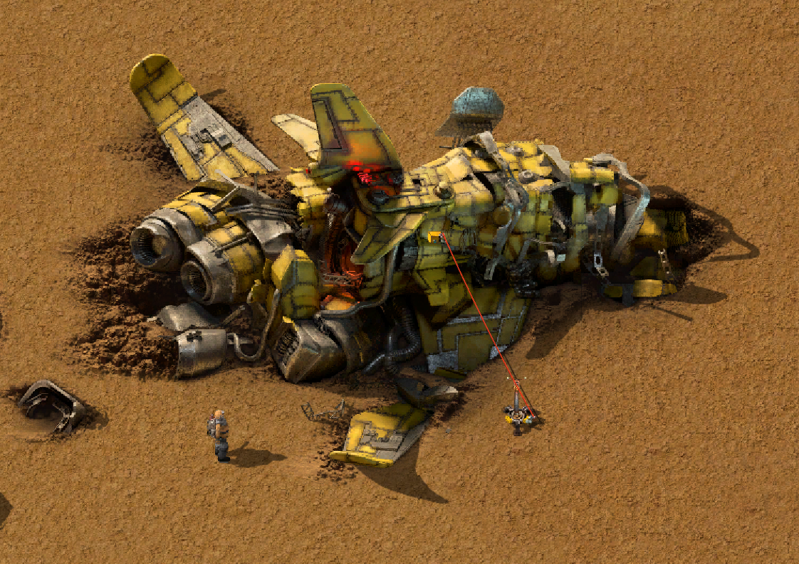

# Crash Site Extended

Mod pour Factorio 2.1.

Il étend les conteneurs déjà présents sur le site du crash initial et permet de lire leur contenu sur le réseau logique :

- vaisseau principal : 100 emplacements ;
- deux gros débris : 50 emplacements chacun ;
- trois débris moyens : 25 emplacements chacun.

Les six inventaires disposent d'une barre rouge de limitation et de filtres par emplacement, comme les wagons de marchandises.

Le mod ne définit aucune nouvelle entité, aucun objet, aucune recette et aucune technologie. La fusée ne peut donc être ni fabriquée, ni placée, ni dupliquée. Elle conserve son comportement vanilla de minage : le joueur peut la supprimer, sans récupérer d'objet permettant de la reconstruire. Son apparence vanilla reste inchangée.

## Détails techniques

Le scénario libre crée le vaisseau et cinq débris disposant d'un inventaire. Le mod modifie directement leurs prototypes vanilla au data stage et leur ajoute le connecteur logique standard des coffres. Aucun script runtime n'est nécessaire.
